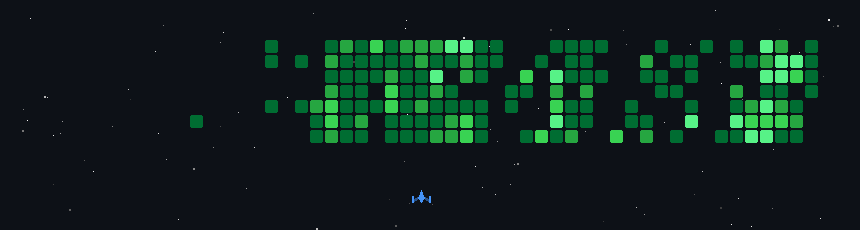

  

## 💫 𝐀𝐛𝐨𝐮𝐭 𝐌𝐞

🎓 𝐀𝐛𝐨𝐮𝐭 𝐌𝐲 𝐄𝐝𝐮𝐜𝐚𝐭𝐢𝐨𝐧  
I’m a **3rd-year B.Tech. Computer Science & Engineering student**, passionate about building real-world applications and strengthening my problem-solving skills.

🔭 𝐈’𝐦 𝐜𝐮𝐫𝐫𝐞𝐧𝐭𝐥𝐲 𝐰𝐨𝐫𝐤𝐢𝐧𝐠 𝐨𝐧  
**Resume Analyzer Website** – a smart tool to analyze resumes, extract key skills, and provide insights using modern web technologies.

🌱 𝐈’𝐦 𝐜𝐮𝐫𝐫𝐞𝐧𝐭𝐥𝐲 𝐥𝐞𝐚𝐫𝐧𝐢𝐧𝐠  
**Data Structures & Algorithms (DSA) using Python**, focusing on problem-solving and interview preparation.

🤝 𝐈’𝐦 𝐥𝐨𝐨𝐤𝐢𝐧𝐠 𝐭𝐨 𝐜𝐨𝐥𝐥𝐚𝐛𝐨𝐫𝐚𝐭𝐞 𝐨𝐧  
Python-based projects, web applications, and beginner-friendly open-source projects.

---

## 🌐 𝐒𝐨𝐜𝐢𝐚𝐥𝐬

  
  
  
  

---

## 💻 𝐓𝐞𝐜𝐡 𝐒𝐭𝐚𝐜𝐤

  
  
  
  
  
  
  
  
  
  

---

### 🧠 𝗖𝗼𝗱𝗶𝗻𝗴 𝗣𝗿𝗼𝗳𝗶𝗹𝗲𝘀

  

---

  

<!-- Proudly created with GPRM -->
